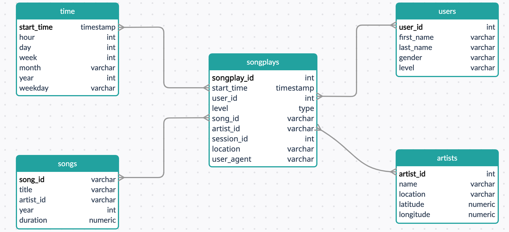

## Introduction

A music streaming startup, Sparkify, has grown their user base and song database and want to move their processes and data onto the cloud. Their data resides in S3, in a directory of JSON logs on user activity on the app, as well as a directory with JSON metadata on the songs in their app.

As their data engineer, you are tasked with building an ETL pipeline that extracts their data from S3, stages them in Redshift, and transforms data into a set of dimensional tables for their analytics team to continue finding insights in what songs their users are listening to. You'll be able to test your database and ETL pipeline by running queries given to you by the analytics team from Sparkify and compare your results with their expected results.

## File structure

sql_queries.py: contains all the drop, create, insert and copy statements that are going to be used throughout the repo

create_tables.py: as the name suggests, responsible for calling the drop statements and then create statement to drop then create all tables to be used.

etl.py: responsible for loading the staging tables and then loading the data to the correponding tables based on the chosen schema

dwh.cfg: a file containing the necessary configurations and roles needed to access the aws clusters and buckets.

IaC.ipynb: a jupyter notebook used as the main entry point to load the credentials, create the cluster and run create_table.py then etl.py and finally cleans up

## The Schema

The schema chosen is star schema, it consists of 1 fact table and 4 dimension tables, but first we copy the data to two staging tables called staging_events and staging_songs for staging the log files and song files seperately.

### Fact table

In the following image the star schema chosen is explained

### Run steps

just run the cells inside IaC.ipynb to the end, everything is explained through markup cells.