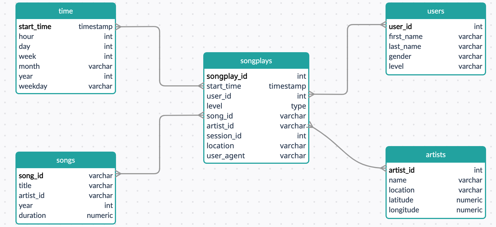

## Introduction

A music streaming startup, Sparkify, has grown their user base and song database and want to move their processes and data onto the cloud. Their data resides in S3, in a directory of JSON logs on user activity on the app, as well as a directory with JSON metadata on the songs in their app.

As their data engineer, you are tasked with building an ETL pipeline that extracts their data from S3, stages them in Redshift, and transforms data into a set of dimensional tables for their analytics team to continue finding insights in what songs their users are listening to. You'll be able to test your database and ETL pipeline by running queries given to you by the analytics team from Sparkify and compare your results with their expected results.

They have lately decided that it is time to introduce more automation and monitoring to their data warehouse ETL pipelines and come to the conclusion that the best tool to achieve this is Apache Airflow.

They have decided to bring you into the project and expect you to create high grade data pipelines that are dynamic and built from reusable tasks, can be monitored, and allow easy backfills. They have also noted that the data quality plays a big part when analyses are executed on top the data warehouse and want to run tests against their datasets after the ETL steps have been executed to catch any discrepancies in the datasets.

## Prerequisistes

Please read "add_airflow_connections" before proceeding to sucessfully add airflow connections.

## File structure

- dags

	This folder contains the dag definition, tasks priority, etc. All in "udac_example_dag.py"

- plugins
	
	This folder contains "helpers" folder, which contains all the helper functions, in our case all the create and insert functions for the tables in the database. It also contains "operators" folder which contains the below:

		- "stage_redshift.py": Loads or stages the data from s3 to redshift
		- "load_dimension.py": Loads and inserts the data to the dimension table
		- "load_fact.py": Loads and insert data to the designated fact table
		- "data_quality.py": Runs check on the data to ensure adequate data quality.

-## The Schema

The schema chosen is star schema, it consists of 1 fact table and 4 dimension tables, but first we copy the data to two staging tables called staging_events and staging_songs for staging the log files and song files seperately.

The star schema is the same as the DWH project and is represented here ()

### Run steps

just run /opt/airflow/start.sh command to start the Airflow webserver, wait for the Airflow web server to be ready. Then access the Airflow UI by clicking on the blue "Access Airflow" button and run the dag!.